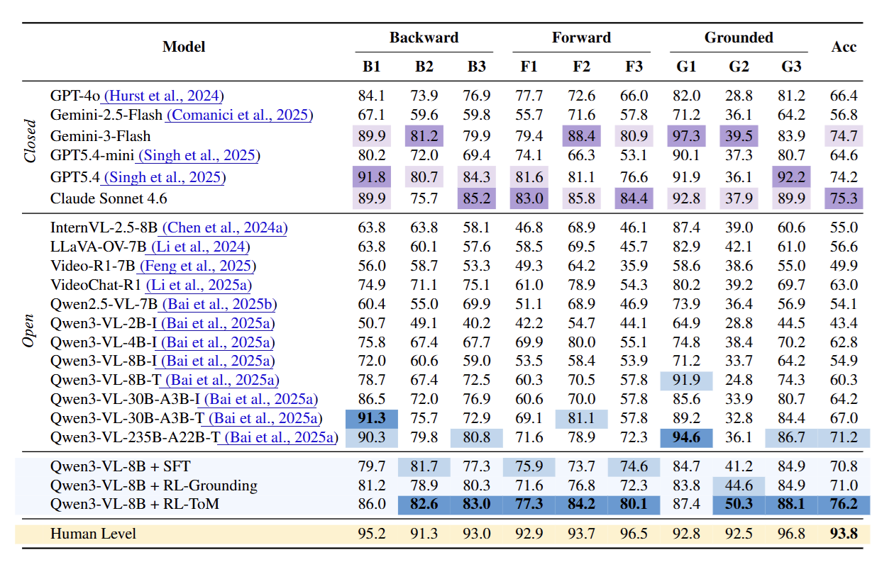
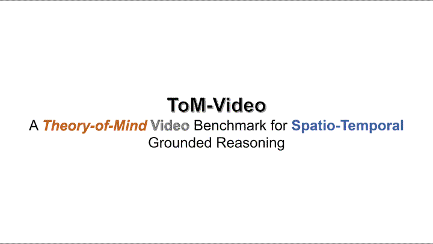

# 🧠 ToM-Video: A Theory-of-Mind Video Benchmark with Spatio-Temporal Grounded Reasoning

  
  
  
  

## 📝 Abstract

Humans can infer others' beliefs, intentions, and emotions from observable behavior, an ability known as Theory of Mind (ToM). While current Multimodal Large Language Models (MLLMs) excel at visual understanding, can they identify mental-state cues in videos and reason about evolving mental states? To systematically evaluate spatio-temporal ToM in MLLMs, we introduce ToM-Video, a large-scale benchmark built from diverse real-world narrative videos. Through multi-stage filtering and annotation from massive data sources, ToM-Video provides a high-quality collection of ToM-centric scenes, comprising 1,487 videos and 41K visual question answering (VQA) pairs. We further propose INSPIRE, a post-training framework that, through a carefully designed three-stage curriculum, progressively teaches models to locate ToM-relevant cues and connect them to latent mental-state changes. Experiments show that current MLLMs remain weak at linking observable cues to evolving mental states, while INSPIRE shifts the model from surface description toward compact, evidence-backed inference, leading to higher accuracy and better generalization to external social-reasoning video datasets.

## 🔎 Overview

ToM reasoning is not only about describing what happens in a video. A model must identify the evidence that a person can perceive, infer how that evidence affects the person's mental state, and reason about what the person will do next. ToM-Video makes this evidence path explicit through a grounded Theory-of-Mind graph.

The benchmark contains:

- **1,487** source videos and **4,666** ToM-dense clips.
- **41,206** five-way multiple-choice questions.
- **57,707** annotated ToM nodes across observable evidence, mental states, and social-cognitive processes.
- Fine-grained grounding through timestamps, keyframe bounding boxes, ASR-aligned speech spans, and source-node chains.
- Nine QA categories covering grounding, backward attribution, and forward prediction.

## ✨ Highlights

| Key point | What ToM-Video makes observable |
| --- | --- |
| Existing benchmarks cannot observe **when a mental-state change occurs**. | Fine-grained spatio-temporal annotations localize **exactly when and where** a reasoning chain breaks in the video. |
| ToM-Video exposes a failure that **scaling does not fix**. | On the hardest temporal-grounding category (G2), larger models do not consistently improve and can answer correctly from the **wrong frames**—a failure made visible by grounded annotations and QA design. |
| ToM-Video provides a taxonomy built around the **temporal and localization structure of video ToM**. | By separating **backward explanation**, **forward prediction**, and **grounded evidence**, the benchmark distinguishes explaining after the fact, predicting mental-state evolution, and faithfully grounding an answer. |
| ToM-Video provides **fine-grained trainable process supervision**. | Frame-level timestamps, keyframe boxes, ASR spans, and source chains support training and evaluation not only for answer correctness, but also for whether an answer is supported by the **right spatio-temporal evidence**. |

## 🏗️ Benchmark Construction

The benchmark construction pipeline filters real-world movie clips, extracts ToM-relevant nodes, verifies visual evidence, grounds keyframes spatially, generates grounded questions, and applies automatic and human quality control.

## 📊 Results

The main experiment evaluates backward, forward, and grounded ToM reasoning across closed-source and open-source video-language models. INSPIRE improves the Qwen3-VL-8B model to **76.2%** overall accuracy, while the human level is **93.8%**.

## 🎬 Case Studies

The following demo provides a qualitative view of ToM-Video and its spatio-temporal grounded reasoning task.

## 💻 Code

The code and data release are being organized and will be added soon. See [`code/README.md`](code/README.md) for the current status.

## ⚖️ License and Data

The code is released under the Apache 2.0 license and the dataset is released under the CC BY-NC 4.0 license. Dataset access instructions and the full release will be added with the code and data release.

## 📮 Contact

For questions or collaboration, please contact [liuquanling@zju.edu.cn](mailto:liuquanling@zju.edu.cn).

## 📚 Citation

The BibTeX entry will be added with the public paper release.
